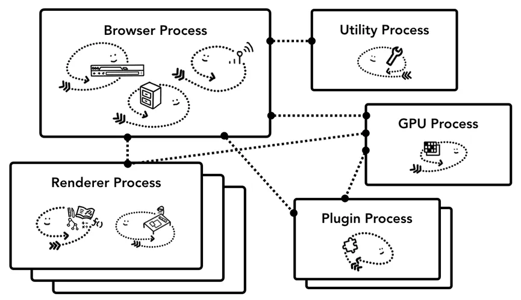
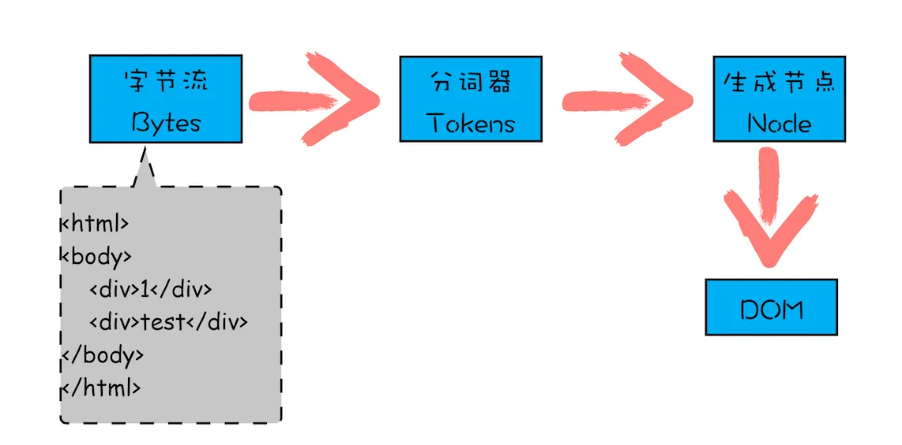
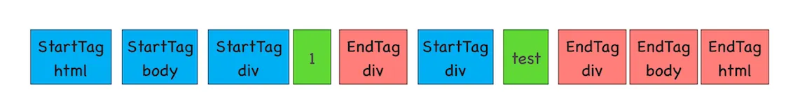
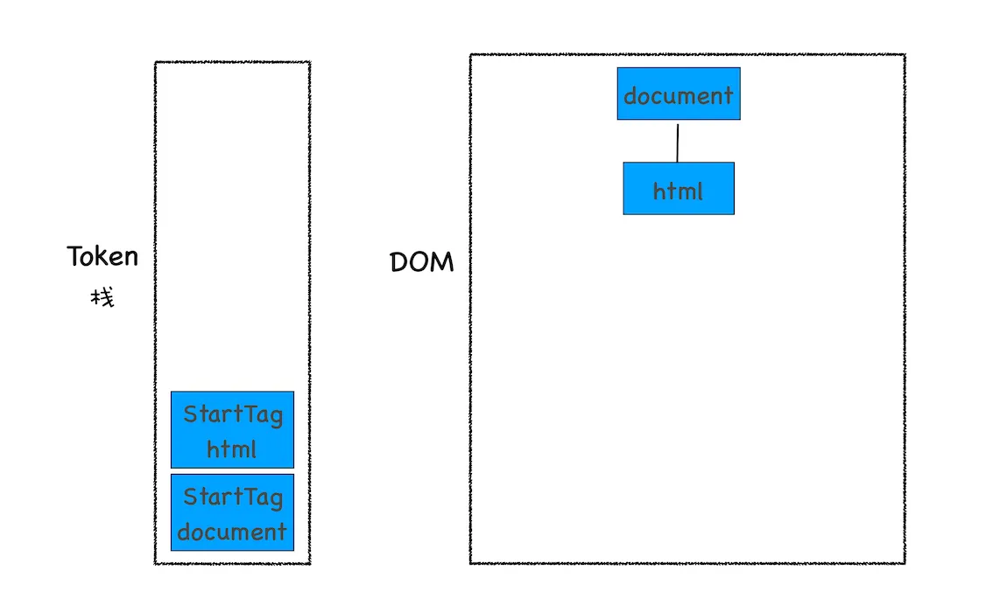
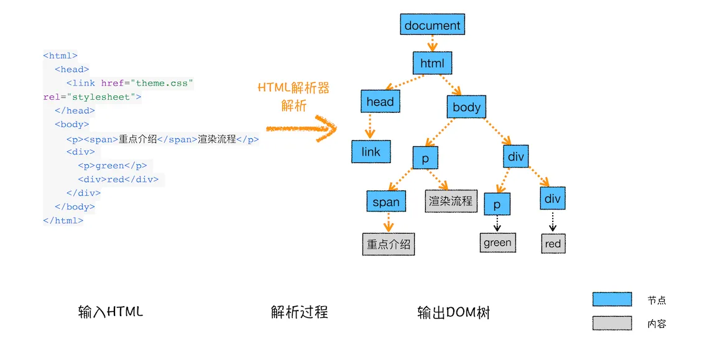
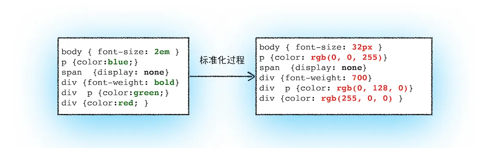
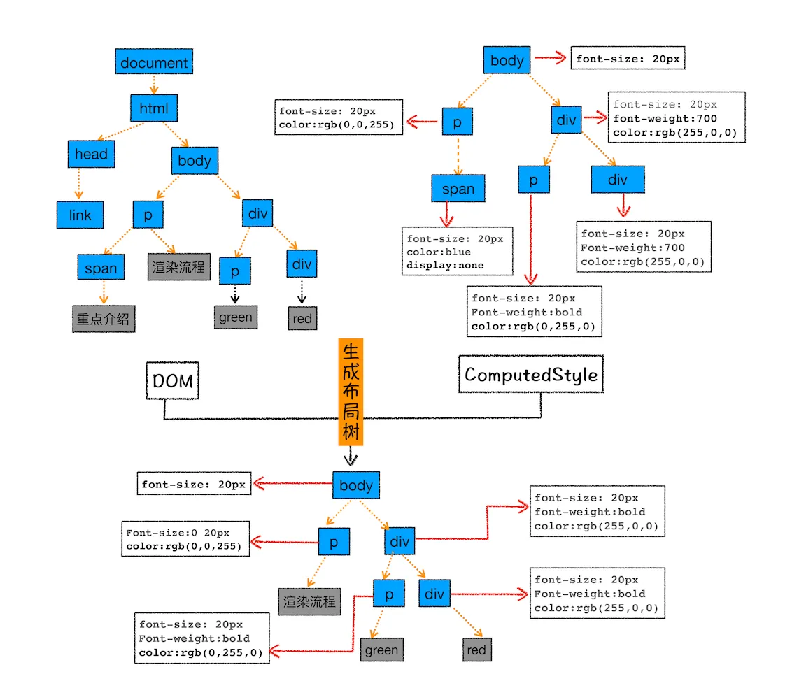
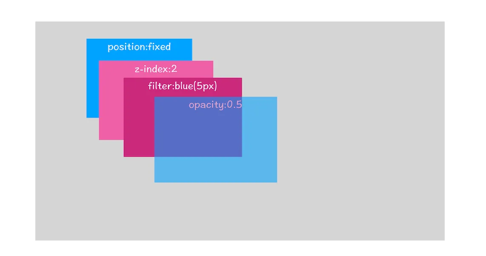

# 浏览器的架构

- 浏览器进程（Browser Process）
  控制浏览器这个应用的 chrome（主框架）部分，包括地址栏、书签、前进/后退按钮等，同时也会处理浏览器不可见的高权限任务，如发送网络请求、访问文件。
- 渲染器进程（Renderer Process）
  控制显示网站的选项卡内的任何内容；图中渲染进程有多层，表示 Chrome 为每个选项卡运行多个渲染器进程。
- 插件进程
  控制网站使用的任何插件，例如 Flash。
- GPU 进程
  在独立的进程中处理 GPU 任务。之所以放到独立的进程，是因为 GPU 要处理来自多个应用的请求，但要在同一个界面上绘制图形。

# 多进程架构优势

- 更强的健壮性
  在最简单的情况下，您可以想象每个选项卡都有自己的渲染器进程。假设您打开了 3 个选项卡，每个选项卡都由一个独立的渲染器进程运行。如果一个选项卡变得无响应，那么您可以关闭无响应的选项卡并继续前进，同时保持其他选项卡处于活动状态。如果所有选项卡都在一个进程上运行，则当一个选项卡无响应时，所有选项卡均无响应。
- 安全性和沙盒
  由于操作系统提供了一种限制进程权限的方法，因此浏览器可以对某些进程的某些功能进行沙箱处理。例如，Chrome 浏览器限制处理任意用户输入的进程（如渲染器进程）的任意文件访问。
- 节省更多的内存（Chrome 中的服务化）
  Chrome 正在经历架构更改，以将浏览器程序的每个部分作为服务运行，从而允许轻松拆分为不同的进程或聚合为一个。
  一般的想法是，当 Chrome 在强大的硬件上运行时，它可能会将每个服务拆分为不同的进程以提供更高的稳定性，但如果它在资源受限的设备上，Chrome 会将服务整合到一个进程中以节省内存占用。
- 站点隔离
  有兴趣的同学可以自行了解[site-isolation](https://developers.google.com/web/updates/2018/09/inside-browser-part1#site-isolation)。

# 渲染流程

渲染流程大致分为几个子阶段：构建 DOM 树、样式计算、布局、分层、绘制、分块、光栅化和合成。

- 构建 DOM 树
  在渲染引擎内部，有个叫 HTML 解析器（HTMLParser）的模块，负责将 HTML 字节流转换成 DOM 结构
  

  1. 通过分词器将字节流转换为 Token

  - Token 分为 Tag Token 和文本 Token
  - Tag Token 又可分为 StartTag 和 EndTag，对应着标签的开和闭，eg：`<body>`、`</body>`
    

  2. 将 Token 解析为 DOM 节点，并将 DOM 节点添加到 DOM 树中

  - HTML 解析器维护了一个 Token 栈结构，用来计算节点之间的父子关系
    
    

- 样式计算

  样式计算的目的是为了计算出 DOM 节点中每个元素的具体样式，大致可分三步

  1. 把 CSS 解析成 CSSOM
     CSSOM（CSS Object Model）是一组允许用 JavaScript 操纵 CSS 的 API。CSSOM 有两个作用，一个是提供给 JavaScript 操作样式表的能力；二是为布局树的合成提供基础的样式信息。
     渲染引擎无法直接理解 CSS 文件的内容，所以需要将其解析成渲染引擎能够理解的结构，即 styleSheets。在浏览器的控制台输入 document.styleSheets 就可以查看其结构
  2. 样式属性标准化
     像 font-size: 2em、coler: blue、font-weight: bold，不容易被渲染引擎理解，所以需要将所有值转换为渲染引擎容易理解的、标准化的计算值，这个过程就是属性值标准化
     
  3. 计算节点的具体样式
     利用 CSS 的[继承规则和层叠规则](https%3A//developer.mozilla.org/zh-CN/docs/Learn/CSS/Building_blocks/Cascade_and_inheritance%23%25E7%2590%2586%25E8%25A7%25A3%25E5%25B1%2582%25E5%258F%25A0)计算出每个节点的具体样式
  4. 布局（Layout）
     现在我们有 DOM 树和 DOM 树中元素的样式，但还不能显示页面，因为缺少了 DOM 元素的几何位置。计算出 DOM 树中可见元素的几何位置，这个过程叫布局。

     - 创建布局树（Layout Tree）
       布局树的基本结构就是复制 DOM 树的结构，循环遍历 DOM 树中所有可见节点，并把这些节点加到布局树中，而不可见的节点会被忽略掉（不可见的元素例如<head>标签下的全部内容，被设为 display: none 的元素）。
       如下图，图中的标签设置了 display: none，会在布局树中移除。
       
     - 布局计算
       精确计算布局树上每个节点尺寸和位置

- 分层（Layer）
  页面中有很多复杂的效果，如 3D 变换、页面滚动，或者使用 z-index 做 z 轴排序等，为了更加方便的实现这些效果，渲染引擎还需要为特定的节点生成专用的图层，并生成一颗对应的图层树（Layer Tree）
  通常满足下面两点中任意一点的元素就可以被提升为单独的一个图层
  1. 拥有层叠上下文属性的元素会被提升为单独的一层
     明确定位属性的元素、定义透明属性的元素、使用 CSS 滤镜的元素等，都拥有层叠上下文属性
     
  2. 需要剪裁（clip）的地方也会被创建为图层
     如`overflow：auto`出现滚动条
