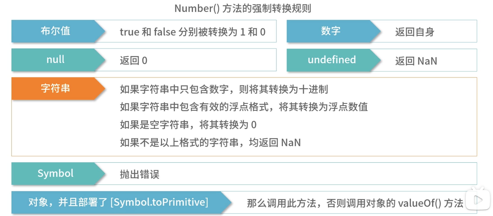
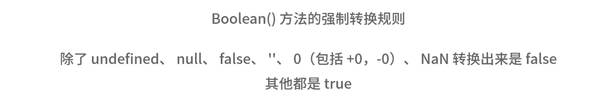
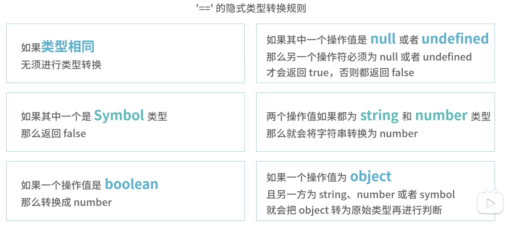
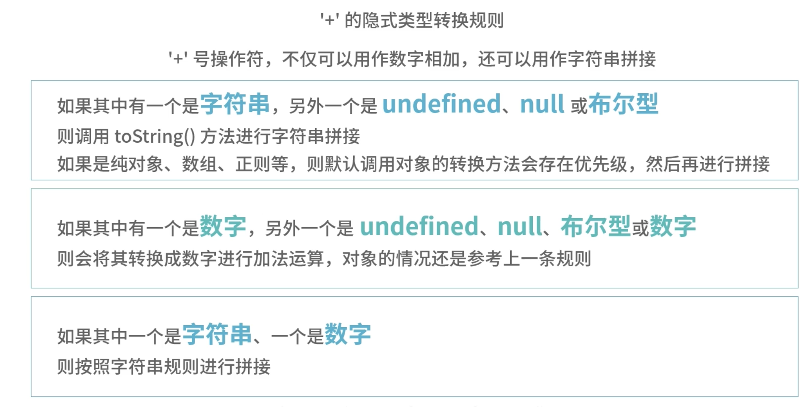

# Number()



- 特别需要注意 `null` 、 `undefined`、`Symbol`、`Object`。
- `Object`类型数据将根据`Symbol.toPrimitive` 、`valueOf`、`toString`（**优先级由高到低**）函数的返回的值继续转换。
- `Symbol.toPrimitive`、`toString`须返回`primitive`类型的值，否则报错，`valueOf`返回非`primitive`类型数据时，转换为 NaN。

```js
let obj = { name: 'xxx', age: 22 };
console.log(Number(obj)); // NaN

obj[Symbol.toPrimitive] = function () {
  //必须返回primitive类型的数据，否则报错
  // return {
  //   [Symbol.toPrimitive](){
  //     return 1
  //   }
  // }
  return 1;
};
console.log(Number(obj)); // 1

obj.valueOf = function () {
  return false;
};
console.log(Number(obj)); // 0

obj.valueOf = function () {
  return {
    valueOf() {
      return 8;
    }
  };
};
console.log(Number(obj)); // NaN


obj.toString = function () {
  return '2'
  // 返回非基本类型数据，会报错
  // return {
  //   toString() {
  //     return 8;
  //   }
  // };
};
console.log(Number(obj)); // 2
```

# Boolean()



# == 隐式转换



object 将调用 valueOf(**优先级高**)、toString 转换为 primitive 值后再做基本类型转换。

```js
let obj = { name: 'xxx', age: 22 };
obj.valueOf = function () {
  console.log('valueOf');
  return 2;
};
obj.toString = function () {
  console.log('toString');
  return '2';
};
console.log(2 == obj);
// valueOf
// true
```

一个有趣的特性

```js
let obj = {
  value: 0,
  valueOf() {
    this.value++;
    console.log(this.value);
    return this.value;
  }
};

console.log(obj == 1 && obj == 2 && obj == 3); // 😄
```

# '+' 隐式转换



```js
1 + 2; //3 常规情况

1 + '2'; // "12" 常规情況

//下面看一下特殊情况
'1' + undefined; // 1undefined 规则1，undefined转换字符串
'1' + null;
//"1null" 规则1，nul转换字符串
'1' + true;
//1true  规则1，true转换字符串
1 + 1n;
//'11' 比较特殊字符串和Biglnt相加，Biglnt转换为字符串
1 + undefined;
// NaN 规则2，undefined转换数字相加NaN
1 + null;
//1 规则2，null转换为0
1 + true;
// 2规则2，true转换为1，二者相加为2
1 + 1n;
// 错误 不能把Biglnt和Number类型直接混合相加
'1' + 3;
//'13' 规则3，字符串拼接
```
